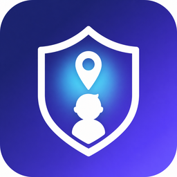

# Modar Family — родительский контроль через интернет

Полный комплект: **приложение для Android** (одно APK, два режима — «Родитель» и «Ребёнок»),
**сервер** с базой на одном файле и **веб-панель** для управления из любого браузера.

Телефон ребёнка выходит на ваш сервер через интернет и присылает отчёты: где он, сколько
времени в приложениях, что за уведомления пришли, куда ходил за сутки. Родитель смотрит
это на карте — в браузере или в приложении — и управляет телефоном: сирена, блокировка
экрана, сообщение, лимиты, запрет приложений и фильтр сайтов.



---

## Что умеет

### Родителю
| Раздел | Возможности |
|---|---|
| 🗺 Карта | геопозиция в реальном времени, маршрут за 1 ч / 6 ч / 24 ч / 7 дней, точность и скорость, метки всех детей |
| 📍 Геозоны | «Дом», «Школа», «Секция» — уведомление, когда ребёнок пришёл или ушёл (радиус 50–5000 м) |
| ⏱ Экранное время | статистика по каждому приложению за день, остаток дневного лимита |
| 🔒 Управление | блокировка и разблокировка экрана, сирена, «найти телефон», сообщение ребёнку, фото с камеры, снимок экрана и «экскурсия» (кадры каждые 2 с), фонарик |
| 📱 Приложения | список установленных приложений, запрет любого из них, лимит минут в день на каждое |
| 🕘 Режимы | «Школа» по расписанию, ночной режим, интернет по расписанию, общий лимит экрана, режим «только учёба» |
| 🚫 Фильтры | взрослый контент, азартные игры, свои запрещённые сайты — работают на телефоне ребёнка без root |
| 🔔 Тревоги | SOS от ребёнка, низкий заряд, «нет связи больше N минут», новые установки, попытки открыть запрещённое |
| 💬 Уведомления и звонки | что приходит ребёнку в мессенджерах; голосовой вызов «родитель ↔ ребёнок» через интернет (опциональный модуль) |
| 🔔 Push | уведомления в браузер, даже когда панель закрыта (Web Push/VAPID) |

### Ребёнку
Красивый статус «связь с родителями есть», большая кнопка **SOS**, честно показанные
экранное время, остаток лимита и активные режимы, а также понятная заглушка вместо
запрещённого приложения или сайта. Никакой рекламы, трекеров и «слежки втихую»:
в статус-баре всегда видно, что служба защиты работает.

---

## Как это выглядит

| Где | Что открыть |
|---|---|
| Веб-панель родителя | адрес вашего сервера в браузере (`https://ваш-сервер/`) |
| Живое демо | `DEMO=1 node server.js` → вход `demo@modar.family` / `demo1234` |
| Приложение | `apk/modar-family.apk` (138 КБ) |

---

## Установка за 4 шага

**1. Сервер** (обязательно — без него интернет-контроль невозможен):

```bash
cd parental/server
node server.js            # http://localhost:8080
# или с демо-данными: DEMO=1 node server.js
```

Развёртывание на Render/Railway/VPS/Raspberry Pi — [`docs/DEPLOY.md`](docs/DEPLOY.md).

**2. Родитель.** Откройте адрес сервера в браузере → «Регистрация» → введите e-mail и пароль.
Готова и веб-панель, и вход в приложении родителя (тот же e-mail и пароль).

**3. Телефон ребёнка.** Панель → «＋ Подключить телефон» → появится код из 6 цифр.
Установите [`apk/modar-family.apk`](apk/modar-family.apk) на телефон ребёнка
(или скачайте прямо с сервера: `ваш-сервер/app/modar-family.apk`), выберите «🧒 Ребёнок»,
введите адрес сервера и код. Дальше выдайте разрешения в разделе **«Разрешения защиты»**:

| Разрешение | Зачем |
|---|---|
| 📍 Геолокация (+ «всегда разрешать») | карта и маршрут |
| 🔔 Доступ к уведомлениям | видеть, что приходит в мессенджерах |
| ♿ Специальные возможности | блокировка запрещённых приложений и сайтов, учёт экранного времени |
| 📊 Статистика приложений | точные цифры по приложениям |
| 🪟 Показ поверх окон | блокировка экрана и всплывающие сообщения |
| 🔋 Работа без ограничений батареи | чтобы служба не «засыпала» |
| 🌐 Фильтр сайтов (VPN) | блокировка сайтов и «интернет по расписанию» |
| 📸 Съёмка экрана | снимок экрана по запросу (Android спросит согласие) |
| 🛡️ Права администратора | выключить экран по команде родителя |

**4. Готово.** В панели появится ребёнок: карта, экранное время, кнопки управления.

---

## Сборка APK

```bash
tools/fetch-toolchain.sh          # один раз: тянет aapt2/d8/apksigner/ecj (~/.cache/tc)
parental/tools/build-apk.sh       # → parental/android/dist/ModarFamily-2.1.0-debug.apk
```

Свой ключ для публикации:

```bash
RELEASE=1 KEYSTORE=my.jks KS_PASS=пароль KEY_ALIAS=mykey parental/tools/build-apk.sh
```

**Сборка «под ключ» для телефона ребёнка** (всё вводится само, ничего не надо набирать):

```bash
MODAR_SERVER=https://family.example.com \
MODAR_CODE=123456 \
parental/tools/build-apk.sh
```

`MODAR_EMAIL` / `MODAR_PASSWORD` дополнительно вшивают вход родителя — такой APK нельзя
публиковать: из него извлекаются данные.

**Голосовые вызовы через интернет** (необязательный модуль WebRTC, +12–20 МБ):

```bash
parental/tools/fetch-webrtc.sh    # скачивает модуль с Maven Central
parental/tools/build-apk.sh       # соберёт APK уже со звонками
```

Без этого модуля приложение работает полностью, только кнопка «Позвонить» предлагает
громкий сигнал на телефон ребёнка + обычный звонок. В APK из этого репозитория
интернет-звонки **выключены** (модуль не скачивался: Maven в среде сборки был недоступен).

---

## Проверка панели без браузера

```bash
npm install jsdom                # один раз
node parental/tools/test-panel.js
```

Тест поднимает панель в jsdom, подсовывает демо-данные и прогоняет все экраны:
карта (включая геометрию тайлов и зум), команды, лимиты, сопряжение, push.
Ожидаемый вывод: `✅ Панель работает без ошибок`.

---

## Как это устроено

```
Телефон ребёнка ──────────────┐
  ChildService (отчёт раз в 5 мин,   ┌─────────────────────────────┐
  геолокация, батарея, экран)        │  Сервер Modar Family        │
  WebFilterService (запреты, сайты)  │  • REST API /api/v1         │
  FilterVpnService (DNS-фильтр)      │  • база db.json (1 файл)    │
  NotifListenerService (уведомления) │  • веб-панель (папка public)│
  ScreenService/CaptureService       │  • Web Push (VAPID)         │
  AlertActivity (замок, сирена, SOS) └─────────────────────────────┘
                                              ▲         ▲
Телефон родителя ─────────────────────────────┘         │
  ParentActivity (карта, команды, лимиты)               │
Браузер родителя ───────────────────────────────────────┘
  веб-панель: своя карта на canvas, команды, лимиты, push
```

* Транспорт — обычный HTTPS: телефоны сами обращаются к серверу, проброс портов не нужен.
* Команды доставляются «в ответе на отчёт» (long-poll не нужен): задержка ≤ интервала отчёта,
  а для срочных команд (`alarm`, `lock`, `message`) телефон дополнительно опрашивает сервер
  каждые 15 секунд.
* Фильтр сайтов работает как локальный DNS-VPN: через туннель идут только DNS-запросы,
  запрещённые домены получают ответ NXDOMAIN, а режим «интернет по расписанию» закрывает
  все домены — остальной трафик идёт напрямую, скорость не падает.
* Часть возможностей Android требует явного согласия человека на телефоне
  (снимок экрана — MediaProjection, права администратора, Special Access). Это ограничение
  системы, обойти его нельзя, поэтому приложение показывает ребёнку и родителю, что и зачем
  включается.

---

## Приватность и закон

* Данные семьи лежат **только на вашем сервере** (`db.json`): ни облака, ни рекламы,
  ни аналитики, ни сторонних SDK.
* Пароль родителя хранится в виде scrypt-хеша, токены — случайные 192-битные строки.
* Сервер можно поставить дома: тогда данные не покидают вашу квартиру.
* ⚠️ Устанавливайте приложение только на **свой** телефон или телефон ребёнка, за которого
  вы отвечаете по закону. Скрытая слежка за взрослыми людьми запрещена; в приложении
  ребёнка всегда видно, что служба работает (постоянное уведомление), а функция снимка
  экрана требует согласия на самом телефоне.

---

## Ограничения (честно)

* Полная фильтрация **всего** трафика без root невозможна: фильтр перехватывает DNS,
  поэтому если в браузере включён «Приватный DNS» (DoT) или приложение ходит по IP-адресам,
  оно может обойти фильтр. Решение: в настройках телефона ребёнка выбрать
  «Приватный DNS: автоматически/выключено».
* «Интернет по расписанию» закрывает домены, но не выключает мобильные данные
  (Android не даёт сторонним приложениям такой возможности). Звонки и SMS при этом работают.
* «Замок» удерживает экран, но принудительный режим киоска (без выхода на рабочий стол)
  требует прав владельца устройства (Android Enterprise) — это описано в планах.
* Голосовые вызовы через интернет требуют доустановки модуля WebRTC (`fetch-webrtc.sh`).
* На бесплатном тарифе Render сервер засыпает после 15 минут простоя — тогда отчёты
  приходят с задержкой до 30 секунд.
